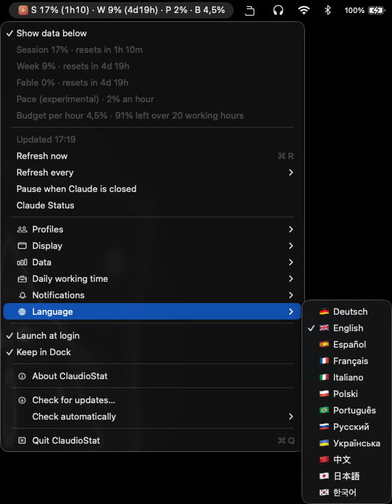

<p align="center">
  
</p>

<h1 align="center">ClaudioStat</h1>

<h3 align="center">Your limits. Zero tokens.</h3>

<p align="center">
  Your Claude plan limits, live in the macOS menu bar.<br>
  A refresh costs zero tokens and never touches your login.
</p>

<p align="center">
  <a href="https://github.com/zolferfigueiredo/claudiostat/releases/latest"></a>
  <a href="https://www.swift.org"></a>
  
  <a href="LICENSE"></a>
  <a href="https://github.com/zolferfigueiredo/claudiostat/actions/workflows/ci.yml"></a>
</p>

<p align="center">
  <a href="https://github.com/zolferfigueiredo/claudiostat/releases/latest"><b>Download for macOS</b></a>
  &nbsp;·&nbsp;
  <a href="https://claudiostat.zolfer.com">Try the menu in your browser</a>
</p>

<p align="center">
  
</p>
<p align="center"><a href="#screenshots"><b>More screenshots</b></a></p>

## Install

1. [Download the DMG](https://github.com/zolferfigueiredo/claudiostat/releases/latest), open it and drag ClaudioStat to Applications.
2. Open ClaudioStat. It's signed and notarized by Apple, so macOS only asks you to confirm the first time.
3. A setup window finds Claude Code and, if it isn't signed in yet, signs you in through your browser. Your numbers then show up in the menu bar.

Or install it with [Homebrew](https://brew.sh/):

```bash
brew tap zolferfigueiredo/claudiostat https://github.com/zolferfigueiredo/claudiostat
brew install --cask claudiostat
```

You need:

- macOS 15 or later, on Apple silicon or Intel
- [Claude Code](https://code.claude.com), or the copy the Claude desktop app keeps for itself
- A Claude plan
- ClaudioStat in Applications, for launch at login and updates

## What the letters mean

| | Limit | What it counts |
|:-:|---|---|
| **S** | Session | Your current 5-hour window |
| **W** | Week | All models, this week |
| **F** | Fable | Fable only, this week |
| **P** | Pace | How fast W rose over the last hour, per day. Off by default |
| **B** | Budget | What's left of the week per day, or per working hour, until the reset. Off by default |

Turn on **Resets in** under Data to add the time to each reset on the line: `S 54% (1h13) · W 6% (1d2h) · F 0% (1d2h)`.

S and W turn orange when you're using them faster than they last until the reset, and red when it's well past that. A warning triangle takes the icon's place when Claude flags a limit.

## Features

- **Every reset, counted down.** Open the menu to see when each limit resets and how much of the week you can use per day.
- **Zero tokens.** It sends Claude Code one `get_usage` request and no prompt, so a refresh takes nothing from your limits.
- **Never sees your login.** Signing in runs Claude Code's own `claude auth login` in your browser. ClaudioStat never sees or stores a credential.
- **Shows when tokens are going.** The icon pulses while Claude Code is writing a reply on this Mac.
- **Tells you in time.** Notifications when a limit is reached, when it resets, and when the week hits 80% and 90%.
- **Sleeps when Claude does.** While neither the Claude app nor Claude Code in a terminal is running, it stops asking, and the last numbers dim so you can tell they're old.
- **Speaks 12 languages.** Deutsch, English, Español, Français, Italiano, Polski, Português, Русский, Українська, 中文, 日本語 and 한국어. It starts in your Mac's language, and **Language** in the menu changes it.
- **Native and tiny.** A small Swift app with no Dock icon. It can launch at login and installs updates in one click.

## Screenshots

<p align="center">
  
  &nbsp;&nbsp;&nbsp;
  
</p>
<p align="center"><sub>The menu bar line, with the app icon (S, W, P and B) or the plain star (S, W, F and B)</sub></p>

## How it works

Every refresh, ClaudioStat runs your installed Claude Code once, headless, and sends it one `get_usage` control request: the same numbers as `/usage`. No prompt goes with it, so it costs zero tokens.

- It looks for `claude` in `~/.local/bin`, `/opt/homebrew/bin` and `/usr/local/bin`, then for the copy the Claude desktop app keeps in `~/Library/Application Support/Claude/claude-code`.
- Claude Code uses its own login. **Sign In** runs `claude auth login`, which finishes in your browser, and **Remove profile** runs `claude auth logout`. ClaudioStat never sees or stores a credential. It keeps only each profile's email, from `claude auth status`, to name it.
- Hooks, plugins and MCP servers are off for that run, and no session is saved.
- To know when Claude Code is writing a reply, it watches the session files in `~/.claude/projects` and reads the end of the one that changed. It keeps and sends nothing.
- **Check for updates…** downloads `latest.json` from claudiostat.zolfer.com and sends nothing about you. An update installs only if it's signed by the same developer, and only into the copy in Applications. While it installs, a window shows each step under a loading bar; **Reopen** then starts the new version. When an automatic check finds a new version, a notification says so once; clicking it offers Update Now.
- Only one copy runs at a time: opening another one, say from the DMG, quits the copy already running.

<details>
<summary><b>Every setting</b></summary>

- **Show data below** (on): every limit with its reset countdown, then pace and the budget.
- **Refresh now** (⌘R), and **Refresh every** 1, 3 (default), 5 or 10 minutes.
- **Pause when Claude is closed** (off): while neither the Claude desktop app nor Claude Code in a terminal is running, nothing refreshes and the last numbers dim. It looks for a running `claude` every minute and when you open the menu. Hidden when neither is installed.
- **Claude Status** opens status.claude.com.
- **Profiles**: one per Claude account, each in its own Claude Code folder and named by its email. The checked one fills the bar and the menu. With none, the menu bar says **Add a profile** and the menu starts with **Add profile…**.
  - **Add profile…** signs in to another account through your browser, into a new folder: `~/.claude-2`, `~/.claude-3` and so on. With no profile left, it signs `~/.claude` in instead.
  - **Remove profile** removes the checked one after asking, `~/.claude` included, and signs it out of Claude Code with `claude auth logout`. For `~/.claude` that is the login Claude Code uses in Terminal too. The folder stays.
  - When the checked profile is signed out, the menu says **Sign in to Claude Code…**, which signs it in again.
- **Display**: icon and text, icon only or text only, with the app icon or a plain star. A letter without a value yet is left out, and with none the bar shows just the icon. **Loading icon** (on) and **Loading text** (off) pick what pulses while Claude Code writes a reply.
- **Data**: whether the menu bar starts with the profile's name (off); **Multiple users** to show every profile one after another, or **Single user** (default) for the checked one; whether it shows F (on), P and B (off), and whether P and B count per day or per hour.
- **Daily working time**: the hours a day you use Claude, 24 down to 4 (8 by default), so P and B leave out the rest of the day.
- **Notifications**: a limit reached, its reset, and the week at 80% and 90%. All on.
- **Launch at login** (from the Applications folder) and **Keep in Dock**.
- **Check for updates…**, and **Check automatically** daily, weekly (default) or never.

</details>

<details>
<summary><b>How pace, budget and the colors are worked out</b></summary>

**P** is how fast W is rising over the last hour, per day (times the working time, 8 hours by default) or per hour, following Budget per day or Budget per hour under Data. It shows "-" in the menu, and stays out of the menu bar, until there's a reading from an hour ago. After a pause, the rise is spread over the whole gap.

**B** is what's left of the week split over the days (or working hours) until the weekly reset, a partial last one counting in full, rounded down: 35% left with 1d 17h to go is 17% a day, or 0.8% an hour with a 24-hour working time. Per hour, the menu says how many working hours it is spread over.

S and W change color when you're using them too fast:

- **S**: its rise over the last 30 minutes against what's left spread evenly until the reset: S 50% with 2 hours left needs 25% per hour.
- **W**: P against B, so it turns orange once P is over B.
- **Orange**: faster than needed. **Red**: 5 points per hour past it for S, 10 points past it for W.

The menu says why under a colored S or W: "Using 24% a day, 17% a day lasts until reset". A warning triangle replaces the icon when Claude itself flags a limit: locked out, or its severity is anything but normal.

</details>

## Build from source

```sh
./build.sh
```

It runs the tests, builds a universal app and writes `dist/ClaudioStat-<version>.dmg`. It needs Xcode 26 (Swift 6.2 or later). Every intermediate goes to a folder in `/tmp` that is deleted when the script ends.

To try a change, run `./run.sh`. It builds a debug copy in `/tmp/claudiostat-run`, quits any running ClaudioStat and opens the new one.

`./run.sh -testNotifications YES` also shows every notification, to check how they read: the update notice, offering the next version, then Week at 80% and 90% and each limit reached, 8 seconds apart. The installed app does the same with `open -a ClaudioStat --args -testNotifications YES` once quit.

CI builds and tests every pull request on macOS, counting any compiler warning as an error. It also runs shellcheck on the scripts, and fails a pull request that changes the app without raising its version in `Info.plist`.

## Disclaimer

Unofficial. Not affiliated with or endorsed by Anthropic. It relies on an experimental Claude Code API that may change or stop working at any time.

## License

[MIT](LICENSE)

---

<p align="center">
  If ClaudioStat is useful to you, please consider giving it a ⭐<br>
  It helps other Claude users find it. Thank you!
</p>

<p align="center">
  Made with ❤️ for the Claude community by <a href="https://zolfer.com">zolfer.com</a>
</p>
